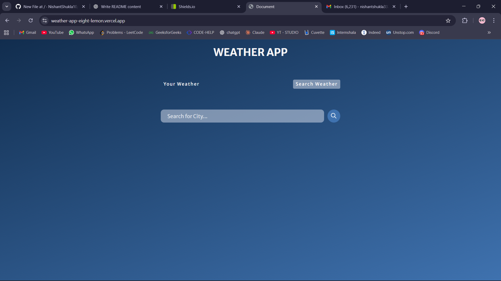
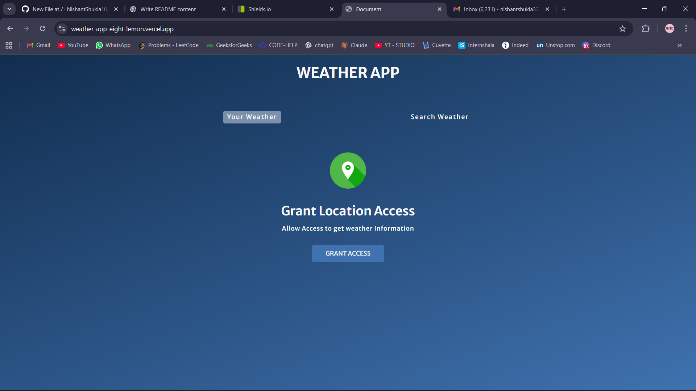
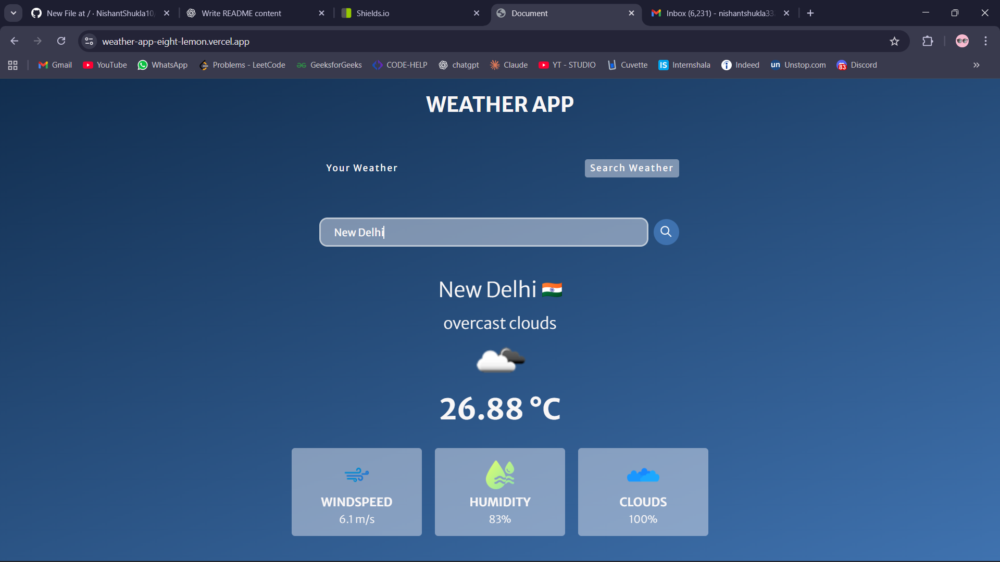

# 🌤️ Weather App  

A simple yet powerful **Weather Application** built with **JavaScript**, **HTML**, and **CSS** that fetches real-time weather data from an API and displays it in an easy-to-use interface.  

👉 **Live Demo:** [https://weather-app-eight-lemon.vercel.app]  

---

## ✨ Features  
- 🔍 **Search Weather by Location** – Get real-time weather updates for any city worldwide.  
- 📍 **My Location Weather** – Fetch weather automatically using your device’s geolocation.  
- 🌡️ Current temperature, weather description, and real-time updates.  
- 💨 Extra details: **wind speed, humidity levels, and cloud information** for a complete weather report.  
- ⚡ Seamless and dynamic user interface with instant updates.  

---

## 🚀 Tech Stack  
- **Language:** JavaScript
- **API:** OpenWeatherMap API
- **Styling:** HTML, CSS  
- **Other:** Geolocation API for fetching user location  

---

## ⚙️ Installation & Setup  

1. Clone the repository  
   ```bash
   git clone https://github.com/your-username/weather-app.git
   cd weather-app

2. Run the index.html file

3. Your APP is ready 🎉

## 📸 Screenshots

### 🔍 Search Weather by Location


### 📍 My Location Weather


### 🌡️ Weather Data Display



## 🤝 Contributing
Contributions, issues, and feature requests are welcome! 
